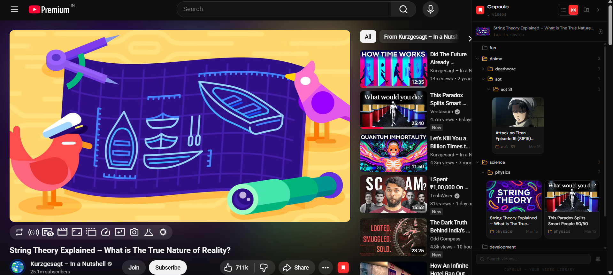

# 📦 Capsules

> The ultimate video organization ecosystem for power users. Organize YouTube content into nested folders, sync across devices, and manage your library through a premium web dashboard.



---

## 🚀 The Ecosystem

Capsules is split into two primary components that work in harmony:

### 1. [Capsule Extension](./capsule-extension)
A powerful Chrome/Edge extension that lives where you watch.
- **Contextual Injections**: Save videos directly from the YouTube player or homepage grid (3-dot menu).
- **Interactive Sidebar**: Manage your folders without leaving the video you're watching.
- **Infinite Nesting**: Organize your library like a professional file system.

### 2. [Capsule Web Dashboard](./capsule-web)
A beautiful, high-performance web application for deep management.
- **Premium Aesthetics**: Glassmorphism design system with dark mode and smooth animations.
- **Cross-Device Sync**: Access your folders and videos from any browser.
- **Mobile Optimized**: A high-density, YouTube-style mobile experience for on-the-go browsing.
- **Advanced Management**: Dedicated tools for renaming, deleting, and rearranging your entire collection.

---

## 🛠️ Tech Stack

### Frontend & Web
- **Next.js 16** (App Router)
- **Tailwind CSS** (Custom Glassmorphism System)
- **Lucide React** (Iconography)
- **Zustand** (Optimistic State Management)

### Extension
- **React 18**
- **Vite 5**
- **Chrome Storage API** (Local + Sync)

### Backend & Database
- **Prisma ORM**
- **Clerck** (Authentication)
- **PostgreSQL / SQLite**

---

## 📂 Project Structure

```bash
Capsules/
├── capsule-extension/    # Chrome Extension source code
└── capsule-web/          # Next.js Web Dashboard source code
```

---

## 🎨 Design Philosophy
Capsules is built with **"Visual Excellence"** in mind. We use a custom design system centered around **Glassmorphism**, vibrant accents, and smooth micro-animations. Whether you are using the sidebar extension or the web dashboard, the experience is designed to feel premium and state-of-the-art.

---

## 🤝 Getting Started
1. **Extension**: [Setup Guide](./capsule-extension/README.md)
2. **Web Dashboard**: [Setup Guide](./capsule-web/README.md)
